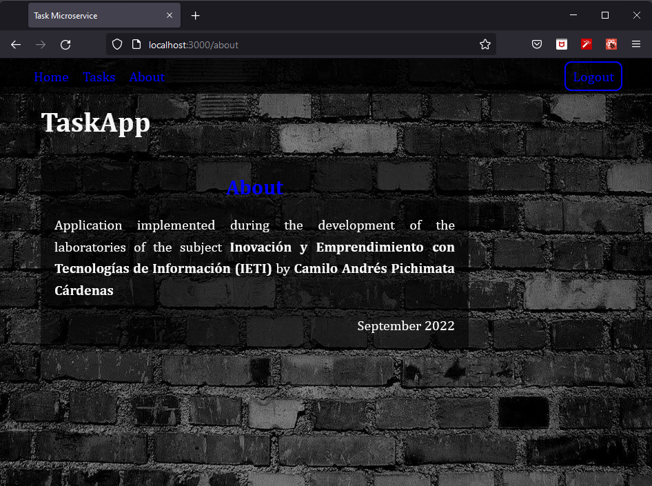

# Laboratorio 6: Hooks / React Router

## Inovación y Emprendimiento con Tecnologías de Información

#### Camilo Andrés Pichimata Cárdenas

##### Septiembre del 2022

## Desarrollo

El presente laboratorio tiene como fin conectar el login realizado en el [laboratorio 5](https://github.com/CamiloPichimata/IETI-Lab_5-Intro_to_React_JS) con el API Restful `Tasks` desarrollada en la segunda parte del [laboratorio 2](https://github.com/CamiloPichimata/IETI-Lab_2-Spring_Boot_REST_API-Tasks_Microservice-Gradle); Para esto se utilizaron diversos hooks de [React](es.reactjs.org), [React Router Web](https://v5.reactrouter.com/web/guides/quick-start) y se realizaron peticiónes GET y POST usando la librería [Axios](https://axios-http.com/docs/intro)

Al API Tasks se le tuvo que agregar la conexión con una base de datos MongoDB debido a que no contaba con ella, a esta misma base de datos se conectó una copia de la API Restful `Users` desarrollada durante los [laboratorios 2, 3 y 4](https://github.com/CamiloPichimata/IETI-Lab_4-Spring_Security_JWT-Users_Microservice-Gradle) con el fin de almacenar los usuarios de la aplicación y restringir el ingreso a este mediante el uso de un token que cuenta con un tiempo determinado de vigencia, en este caso 60 minutos.

A continuación, se presenta la interfaz de la aplicación y su funcionamiento:

### Instalación

Para la ejecución de la aplicación después de clonar el respositorio se deben ejecutar por separado la aplicación `Tasks` y la aplicación `Users`, debido a que en este caso ambas aplicaciones se implementaron usando Spring Boot, por defecto estas buscan correr en el mismo puerto **8080**, para evitar conflictos en el archivo **aplication.properties** de `users` se incluyó la siguiente línea

```
server.port=8081
```

Esto se realiza con el fin de configurar el puerto **8081** para la ejecución de la aplicación.

Después de ejecutar las dos aplicaciones se debe ejecutar la aplicación de React, en este caso ejecutando el comando `npm start`.

### Ejecución

Se abre la aplicación web en la dirección `http://localhost:3000/`, en este caso se muestra la página de inicio (Home)


Si damos click sobre el texto **_Let us help you!_** la aplicación redirigirá al usuario a la página Tasks de la aplicación en caso de estar logueado, de lo contrario se redirige a la página de login:


Si damos click en el botón _Login_ sin especificar credenciales obtenemos un error y se muestra una alerta que indica que se deben llenar todos los campos.


Del mismo modo al dar click en aceptar se resaltan los campos vacíos y se mustra un mensaje por campo solicitando rellenarlo:


Rellenamos los campos y damos click en el botón _Login_:


Al dar click se realiza una petición **POST** usando Axios a la dirección web `http://localhost:8081/api/v2/auth` a la que se envían las credenciales ingresadas en el formulario de Login; esta petición es recibida por la aplicación _Users_ la cuál verifica si las credenciales pertenecen a un usuario registrado con anterioridad en la base de datos, si esto no es cierto, la aplicación reponde con un error, por otro lado, si los datos coinciden con un registro, la aplicación responde con un token y su fecha de expiración, estos datos son recibidas por la aplicación web y son almacenadas. Si todo sale bien, se redirige a la página _Tasks_:


En esta página se visualizan las tareas almacenadas en la base de datos, para obtenerlas se realiza una petición **GET** a la dirección web `http://localhost:8080/api/v2/tasks/`, esta petición es recibida por la aplicación _Tasks_ y esta nos responde con una lista de tareas que son procesadas y mapeadas por la aplicación web, para poder hacer esto es necesario tener almacenado el token enviado por la aplicación de _Users_, esto se verifica al momento de ingresar a la página de tareas justo antes de solicitar el listado, en caso de que el token haya caducado la sesión se cerrará y se redirigirá a la página de _Login_ para ingresar las credenciales y obtener un nuevo token.

Como se puede ver en la imagen anterior, en la lista de opciones del menú superior ya no se visualiza la opción para ir a la página de _Login_, pero a su vez, se encuentra un botón con el que se puede cerrar la sesión en la esquina superior derecha.

A las páginas _Home_ y _About_ se puede acceder sin necesidad de loguearse en la aplicación, estas páginas fueron diseñadas con el dín de probar el correcto funcionamiento de React Ruoter

Damos click en la opción _About_ para visualizar dicha página:



Finalmente si damos click en el botón _Logout_ cerraremos la cesión, pero en este caso, permaneceremos en la página _About_. Como se puede ver el botón de **Logout** ha desaparecido y nuevamente se visualiza en la parte superior la opción para realizar el login. En caso de cerrar sesión en la página _Tasks_ seremos redirigidos automáticamente a la página _Login_:


# Laboratorio 7: Buenas practicas de Código

## Inovación y Emprendimiento con Tecnologías de Información

#### Camilo Andrés Pichimata Cárdenas

##### Septiembre del 2022

## Desarrollo

Para el desarrollo de este laboratorio se trabajó sobre una nueva rama llamada [`Lab_7`](https://github.com/CamiloPichimata/IETI-Lab_6-Hooks-React_Router/tree/Lab_7) en el laboratorio 6

### Parte 1: VSCode

1. Se realizó la instalación del plugin **_Prettier_** en _VSCode_


2. Se realizó la instalación del plugin **_Eslint_** en _VSCode_


### Parte 2: Eslint

1. Se abrió el archivo **[package.json](https://github.com/CamiloPichimata/IETI-Lab_6-Hooks-React_Router/blob/master/WebApplication/package.json)**, nos dirigimos a `eslintConfig`, en donde encontramos lo siguiente:

```json
  "eslintConfig": {
    "extends": [
      "react-app",
      "react-app/jest"
    ]
  },
```

Modificamos hasta obtener lo siguiente y guardamos

```json
  "eslintConfig": {
    "extends": [
      "eslint:recommended",
      "react-app",
      "react-app/jest",
      "prettier"
    ]
  },
```

2. Ejecutamos el comando `npm i -D eslint` desde el directorio raiz de la aplicación.


3. Agregamos las siguientes líneas al archivo **[package.json](https://github.com/CamiloPichimata/IETI-Lab_6-Hooks-React_Router/blob/master/WebApplication/package.json)** en `scripts`

```json
"lint": "eslint --ext .js,.jsx .",
"lint:fix": "npm run lint -- --fix"
```

Obtenemos lo siguiente:

```json
  "scripts": {
    "start": "react-scripts start",
    "build": "react-scripts build",
    "test": "react-scripts test",
    "eject": "react-scripts eject",
    "lint": "eslint --ext .js,.jsx .",
    "lint:fix": "npm run lint -- --fix"
  },
```

4. Se ha completado la instalación y configuración del complemento, si todo sale bien al poner el puntero del mouse sobre algún error o marca de error en el editor, se debe visualizar un mensaje por parte de **_eslint_**, en este caso se agregó una variable que no ha sido usada en ningún lado, se puede observar el siguiente mensaje por parte de **_eslint_**:


### Parte 3: Prettier

1. Se agregón una nueva llave llamada `"prettier"` abajo de `eslintConfig` como se puede ver a continuación:

```json
  ...
  "eslintConfig": {
    "extends": [
      ...
    ]
  },
  "prettier": {
  },
  "browserslist": {
    ...
```

2. Nos dirigimos a **_file/preferences/settings_** y en la configuración de usuarios (Users) vamos a **_Text Editor / Formatting_**; Allí damos clic en el checkbox **Format On Save** como se puede ver a continuación:


### Parte 4: Husky

Corremos los siguientes comandos desde la dirección raiz de la aplicación:

```
npm i -D husky
```


```
npm set-script prepare "husky install"
```


```
npm run prepare
```


```
npm i -D prettier
```


```
npm set-script format "prettier --write ."
```


```
npx husky add .husky/pre-commit "npm run lint:fix && npm format"
```


Ahora cada vez que se intente realizar un commit, entes de que este se lleve a cabo, se valida que no hayan errores de **eslint** y se formatearán los archivos del proyecto usando la configuración de **prettier**.

# Laboratorio 8: Stage Management / PWA

## Inovación y Emprendimiento con Tecnologías de Información

#### Camilo Andrés Pichimata Cárdenas

##### Octubre del 2022

## Desarrollo

Las implementaciones de este laboratorio se desarrollaron sobre una nueva rama creada en el laboratorio 6 llamada `Lab_8` a la que se puede acceder dando click [aqui](https://github.com/CamiloPichimata/IETI-Lab_6-Hooks-React_Router/tree/Lab_8)

### Parte 1: PWA

Comenzamos ejecutando la aplicación teniendo en cuenta que se cuenta con 3 servicios separados, uno para validar las credenciales ingresadas por el usuario que se encuentra utilizando la aplicación, otro para obtener el listado de tareas del ususario y finalmente, se ejecuta la aplicación de React con el comando `npm start` desde la capeta raiz de la aplicación.

Seguido a esto vamos a la dirección `http://localhost:3000/tasks` desde el navegador **Chrome** abrimos las herramientas de administrador y nos dirigimos a la pestaña **_Lighthouse_** donde podemos visualizar lo siguiente:


Dentro de **Categorías** seleccionamos unicamente la opción _Aplicación web progresiva_ y en **Dispositivo** seleccionamos la opción _Móvil_ como se ve a continuación:


Damos click en el botón `Analizar carga de la página` y esperamos...


Se obtuvo lo siguiente:


Como se puede ver, la aplicación no cumple los requisitos de instalación para ser una Aplicación Web Progresiva, para dar solución a esto debemos realizar las siguientes implementaciones y modificaciones:

- Se crea un nuevo archivo llamado **_worker.js_** dentro de la carpeta **_public_** con el siguiente contenido:

```javascript
/* eslint-disable no-restricted-globals */

var CACHE_NAME = "pwa-task-planner";
// Update this array to your defined routes
var urlsToCache = ["/"];

// Install a service worker
self.addEventListener("install", (event) => {
  // Perform install steps
  event.waitUntil(
    caches.open(CACHE_NAME).then(function (cache) {
      console.log("Opened cache");
      return cache.addAll(urlsToCache);
    })
  );
});

// Cache and return requests
self.addEventListener("fetch", (event) => {
  event.respondWith(
    caches.match(event.request).then(function (response) {
      // Cache hit - return response
      if (response) {
        return response;
      }
      return fetch(event.request);
    })
  );
});

// Update a service worker
self.addEventListener("activate", (event) => {
  var cacheWhitelist = ["pwa-task-planner"];
  event.waitUntil(
    caches.keys().then((cacheNames) => {
      return Promise.all(
        cacheNames.map((cacheName) => {
          if (cacheWhitelist.indexOf(cacheName) === -1) {
            return caches.delete(cacheName);
          }
        })
      );
    })
  );
});
```

- Se modifica el archivo **_index.html_** de la siguiente manera:

```html
<!DOCTYPE html>
<html lang="en">
  <head>
    <meta charset="utf-8" />
    <meta name="viewport" content="width=device-width, initial-scale=1" />
    <meta name="theme-color" content="#000000" />
    <meta
      name="description"
      content="Web site created using create-react-app"
    />
    <link rel="apple-touch-icon" href="%PUBLIC_URL%/logo192.png" />
    <!--
      manifest.json provides metadata used when your web app is installed on a
      user's mobile device or desktop. See https://developers.google.com/web/fundamentals/web-app-manifest/
    -->
    <link rel="manifest" href="%PUBLIC_URL%/manifest.json" />
    <!--
      Notice the use of %PUBLIC_URL% in the tags above.
      It will be replaced with the URL of the `public` folder during the build.
      Only files inside the `public` folder can be referenced from the HTML.
      Unlike "/favicon.ico" or "favicon.ico", "%PUBLIC_URL%/favicon.ico" will
      work correctly both with client-side routing and a non-root public URL.
      Learn how to configure a non-root public URL by running `npm run build`.
    -->
    <title>Task Microservice</title>
  </head>
  <body>
    <noscript>You need to enable JavaScript to run this app.</noscript>
    <div id="root"></div>
    <script>
      if ("serviceWorker" in navigator) {
        window.addEventListener("load", function () {
          navigator.serviceWorker
            .register("worker.js")
            .then(
              function (registration) {
                console.log(
                  "Worker registration successful",
                  registration.scope
                );
              },
              function (err) {
                console.log("Worker registration failed", err);
              }
            )
            .catch(function (err) {
              console.log(err);
            });
        });
      } else {
        console.log("Service Worker is not supported by browser.");
      }
    </script>
  </body>
</html>
```

Se crea un nuevo archivo dentro del directorio **_src_** llamado **_serviceWorkerRegistration.js_**

- Se actualiza el archivo **_src/index.js_** agregando la siguiente línea al final

```javascript
serviceWorker.register();
```

Seguido a eso se agrega el import necesario para el llamado de la función de la seiguiente manera:

```javascript
import * as serviceWorker from "./serviceWorkerRegistration";
```

- Agregamos la línea `"purpose": "any maskable"` en el archivo **_manifest.json_** con el fin de agregar la conpatibilidad con iconos enmascarables para el ícono de la aplicación:

```json
{
  "short_name": "React App",
  "name": "Create React App Sample",
  "icons": [
    {
      "src": "favicon.ico",
      "sizes": "64x64 32x32 24x24 16x16",
      "type": "image/x-icon",
      "purpose": "any maskable"   // (new line)
    },
    ...
  ],
  ...
}
```

Corremos de nuevo la aplicación, recargamos la página y ejecutamos _Lighthouse_ nuevamente para obtener un nuevo reporte en el que se obtiene lo siguiente:


Cómo se puede ver nuestra aplicación ahora cumple con todos los requisitos para ser una **Aplicación Web Progresiva**
