# Laboratorio 1 (Parte 2): Implementación del Microservicio **Tasks** RESTFUL API
## Inovación y Emprendimiento con Tecnologías de Información
#### Camilo Andrés Pichimata Cárdenas
##### Agosto del 2022

## Objetivos
- Explicar lo que se debe hacer para alcanzar el nivel 2 en una API RESTFUL en el modelo de madurez de Richardson.
- Implementar un microservicio API RESTFUL para usuarios (Users) de nivel 2.
- Implementar un microservicio API RESTFUL de tareas (Tasks) de nivel 2.
- Inyección de dependencias de usuario para crear una arquitectura desacoplada.

## Temas Principales
- Microservicios.
- RESTFUL API.
- Modelo de Madurez de Richardson.
- Inyección de Dependencias.

## Ejecución
Para poder ejecutar la aplicación desde la línea de comandos se debe tener en cuenta que en el archivo `build.gradle` se debe incluir el plugin *application* y se debe definir la clase principal de la aplicación al final del archivo declarando la etiqueta *mainClassName*.

Teniendo en cuenta lo anterior, se procede a compilar la aplicación, para esto desde la carpeta raíz de esta se ejecuta el comando `gradle build` como se puede ver a continuación:
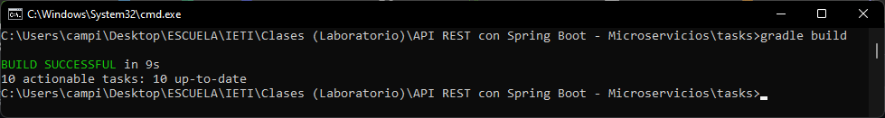

Después de compilada la ejecución se corre la aplicación ejecutando el comando `gradle run`, esto se puede ver a continuación:
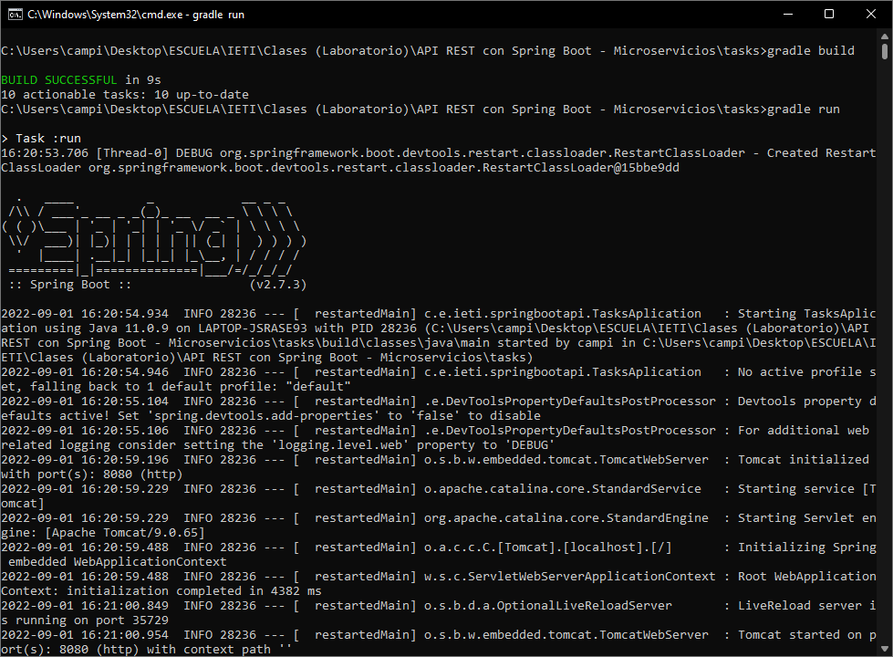

## Pruebas
Después de realizadas las implementaciones correspondientes se realizan las prubas de los endpoints del API usando la aplicación [Insomnia](https://insomnia.rest/download).

Las pruebas realizadas se presentan a continuación:
### - Create
Se crea una tarea nueva realizando una petición ***POST*** a la dirección `http://localhost:8080/` con la siguiente información:
```json
{"id": "1", "name": "Laboratorio", "description": "Laboratorio de la semana", "status": "DOING", "assignedTo": "Juan Pérez", "dueDate": "2022-09-02T04:39:55.688+00:00", "createAt": "2022-08-29T04:39:55.688+00:00"}
```
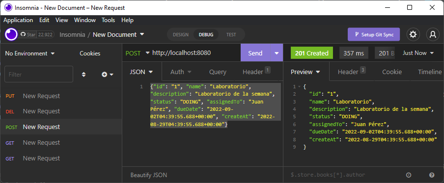

Si se intenta crear nuevamente la tarea anterior, no será posible, esto debido a que su *ID* ya se encuentra registrado en el sistema por lo que se presenta un conflicto, en este caso la aplicación responde con el código de error **409 (Conflict)**:
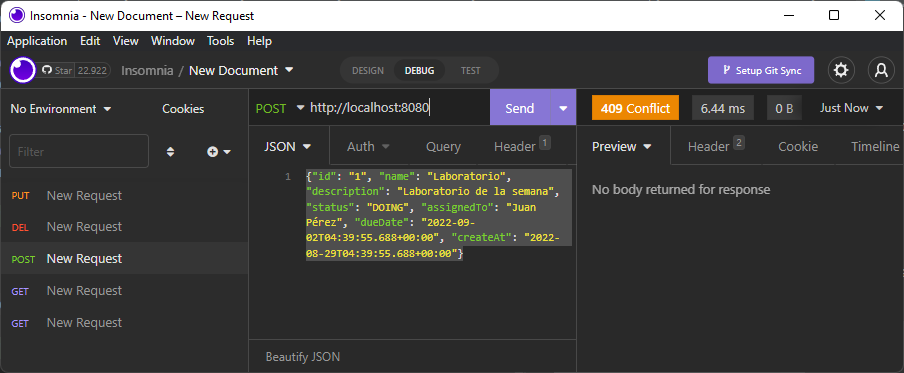

Como se puede observar, el *ID* especificado es el mismo al de la primera inserción, por lo que la acción no se permite.
Si creamos una nueva tarea con un *ID* diferente, esta se podrá registrar en el sistema sin ningún inconvemiente:
```json
{"id": "2", "name": "Tarea 1", "description": "Realizar una investigación acerca de los términos seleccionados", "status": "TODO", "assignedTo": "Pablo López", "dueDate": "2022-09-02T04:39:55.688+00:00", "createAt": "2022-08-29T04:39:55.688+00:00"}
```
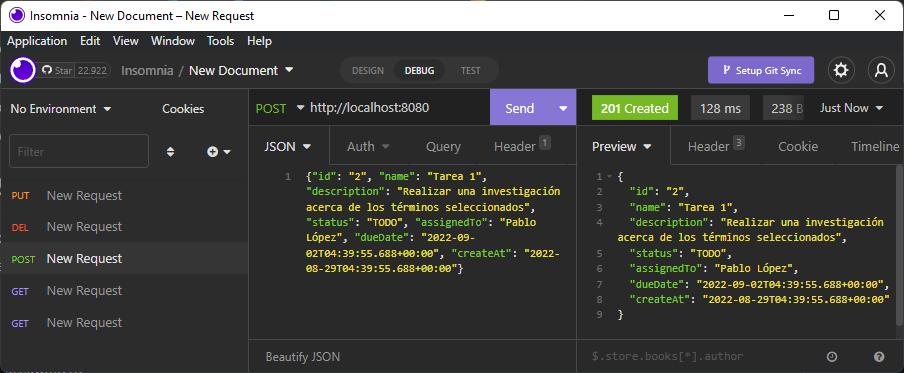

En los casos en que no se presente ningún inconveniente en el registro de la nueva tarea, la aplicación responde con el código de respuesta **201 (Created)**, 

### - Get all
Para obtener el listado de todas las tareas registradas, se realiza una petición ***GET*** a la dirección `http://localhost:8080/` como se puede observar a continuación:
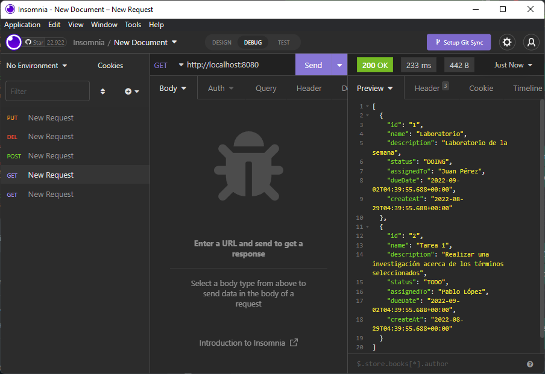
En la imagen se pueden observar los datos de las dos tareas registradas anteriormente.

### - Find By Id
Para obtener la información de una tarea teniendo en cuenta su *ID*, se realiza una petición ***GET*** de acuerdo con el siguiente formato `http://localhost:8080/{ID}`, donde se reemplaza `{ID}` por el identificador de la tarea a consultar, a continuación se presenta la consulta para la tarea que tiene un ***ID = 1***, en la imagen se puede observar la información obtenida al realizar la consulta:
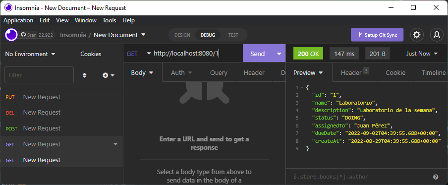
En caso de que se intente realizar una petición con un *ID* no registrado, por ejemplo ***ID = 5***, se responde con el código de error **404 (Not Found)** como se puede observar a continuación:
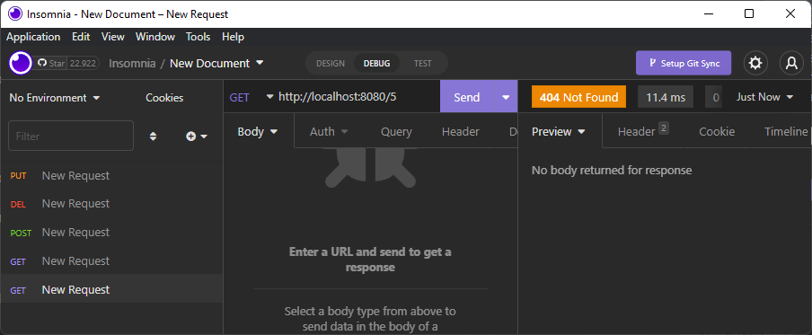

### - Update
Para la actualización de la información de una tarea específica se realiza una petición ***PUT*** teniendo en cuenta el siguiente formato `http://localhost:8080/{ID}`, donde se reemplaza `{ID}` por el identificador de la tarea a modificar, en este caso cambiaremos el *status* de la tarea con ***ID = 2*** de `TODO` a `DONE` con el fin de indicar que ya se realizó:
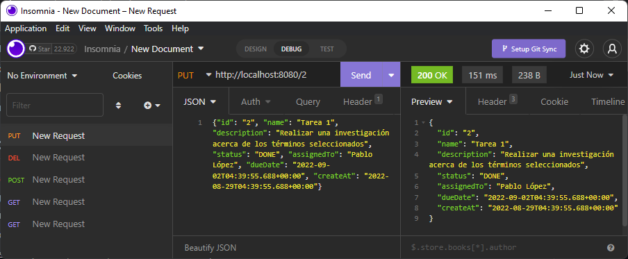
En caso de que el *ID* especificado en la dirección de la petición no se encuentre registrado con anterioridad, el sistema responderá con el código de error **404 (Not Found)** como se puede observar a continuación:
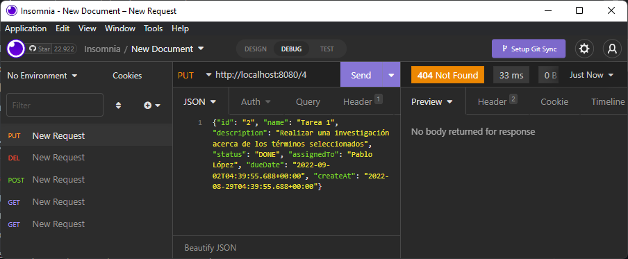

### - Delete
Para eliminar la información de una tarea registrada se realiza una petición ***DEL*** teniendo en cuenta el siguiente formato `http://localhost:8080/{ID}` reemplazando `{ID}` por el identificador de la tarea a eliminar como se mencionó anteriormente, en este caso se eliminará la tarea con ***ID = 1***:
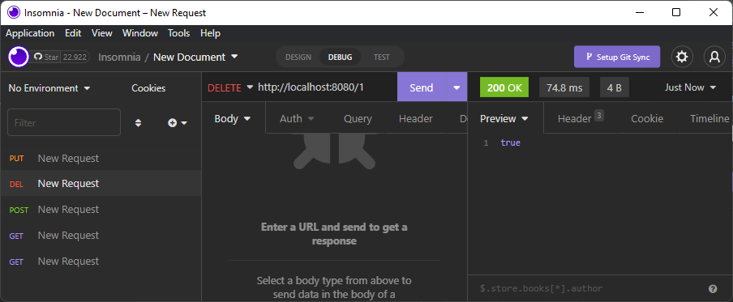
Al obtener nuevamente el listado de las tareas registradas se puede observar que la información del usuario que se eliminó ya no se encuentra:
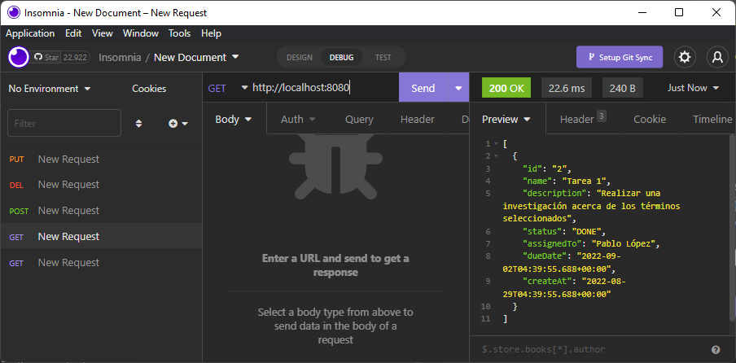